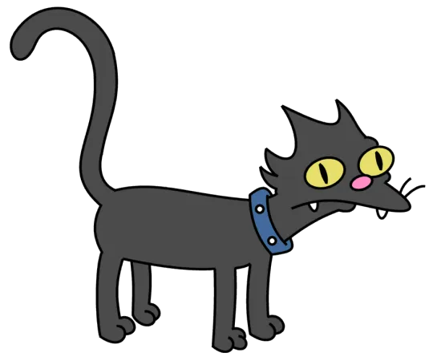

# 🤗 HuggingFace WeeklyPapers 기반 AI/ML/DL/LLM 스택 RAG 챗봇 

**팀명 : 해조**

## 👥 팀원
|  <br> 김지은 |   <br> 박다정 |   <br> 오학성 |   <br> 정소영 |   <br> 황수현 |
|:------:|:------:|:------:|:------:|:------:|

## 1. 프로젝트 소개 및 목표

### 1.1 프로젝트 소개

이 프로젝트는 **HuggingFace Weekly Papers** 데이터를 자동으로 수집·분석하여,  
최신 **AI/ML/DL/LLM 논문 트렌드**를 질의응답 형태로 제공하는 **RAG 기반 논문 검색 챗봇**입니다.
  - **핵심 기능:**
  - HuggingFace Weekly Papers를 정기적으로 **크롤링**
  - 논문 Abstract를 **청킹 + 임베딩 + 벡터DB 저장**
  - **K-Means 클러스터링 + 클러스터 메타데이터**로 트렌드/토픽 구조화
  - **LangGraph** 기반 RAG 라우팅으로 검색 전략 자동 선택
  - **HTML/JS UI + FastAPI 백엔드**를 통한 웹 챗봇 제공
  - **클러스터 기반** 트렌드 키워드 추출 및 노출

### 1.2 목표

- RAG 파이프라인 전체(크롤링 → 전처리 → 벡터DB → RAG → UI)를 **직접 구현하고 이해하는 것**
- **클러스터링 + 하이브리드 검색(BM25 + Vector + RRF)** 으로 검색 품질 향상
- **LangGraph 기반 조건부 라우팅(Conditional Routing)** + 웹 검색 fallback 구조를 갖춘 AI 논문 검색 플랫폼을 구현

## 2. 프로젝트 디렉토리 구조
```bash
SKN20-4th-2TEAM/

```